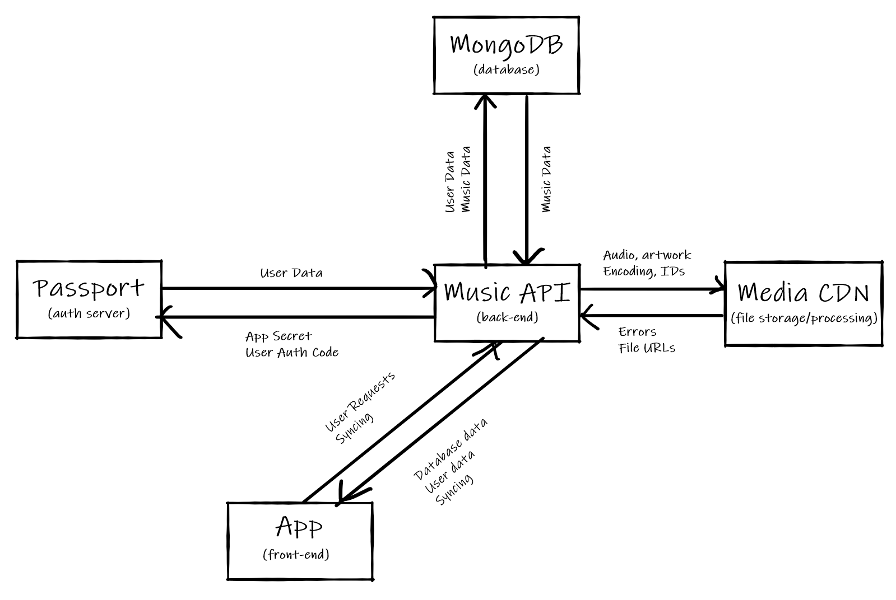

# Merely Music
A MongoDB and React Native (Web)-powered music streaming service with an Express.js back end. Designed to be an open-source replacement for Google Play Music (now sunsetted).

> This project is being completed under supervision for a graduate project, more details about the project will be released after this is complete.

## Structure
 - [passport.yiays.com](https://passport.yiays.com) manages authentication and user account management.
 - A database in MongoDB stores metadata, records file location information, and stores playlists, queues, and user activity.
 - A [Media CDN](https://cdn.yiays.com) stores music files, artwork, and transcodes media to common formats.
 - A [Music API](server) manages state, and is central to all communication between other modules.
 - The [App](app) provides a user interface and offline functionality in the browser, on Android, and on iOS. *Hopefully coming to more platforms with time.*

Here's a dataflow diagram that shows how all the modules are connected.

